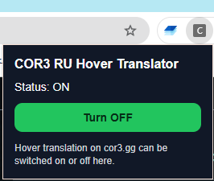
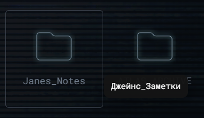
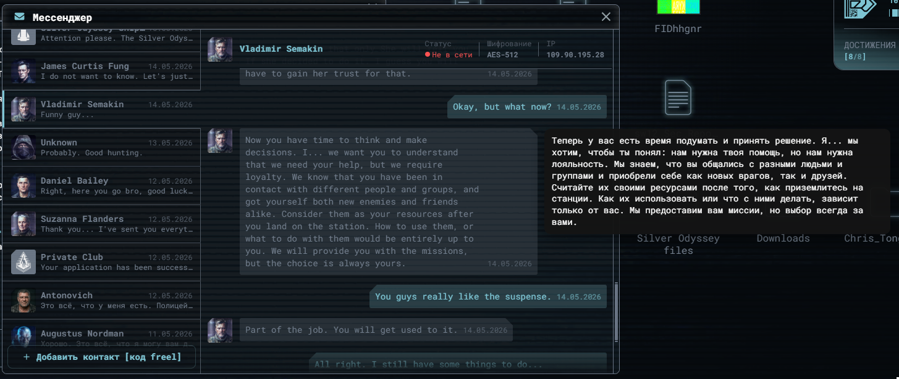

# COR3 RU Hover Translator

Unofficial handmade Chrome extension for Russian hover translation on `cor3.gg`.

The extension shows a Russian translation tooltip when the cursor is placed directly over English text on active `cor3.gg` pages.

> **Disclaimer:** This is an unofficial handmade project created for personal convenience. It is not affiliated with, endorsed by, or supported by `cor3.gg` or its developers. The user is solely responsible for installing, using, modifying, and distributing this code.

## Features

- Russian hover translation for visible English text on `cor3.gg`.
- Works as a Chrome extension using Manifest V3.
- Translation appears only when the cursor is directly over rendered text.
- Empty areas inside cards, panels, or large `div` blocks should not trigger translation.
- Protection against translating text hidden behind active upper windows, modals, or panels.
- ON/OFF toggle from the browser extension popup.
- Long text support:
  - source text up to 12000 characters;
  - long text is translated in chunks;
  - for source text longer than 1200 characters, the tooltip becomes scrollable and gets a close button.
- Short translations use a compact non-interactive tooltip without a close button or internal scroll.
- Uses the public Google Translate endpoint without an API key.

## Screenshots

> **Spoiler warning:** Screenshots may contain in-game text, interface elements, or content that the user has not reached yet.








## Installation

The extension source code is separated into the `extension/` folder. Repository documentation and GitHub files are kept in the repository root.


1. Download or clone this repository.
2. Open Chrome.
3. Go to:

```text
chrome://extensions/
```

4. Enable **Developer mode**.
5. Click **Load unpacked**.
6. Select the `extension/` folder that contains `manifest.json`.
7. Open or refresh `https://cor3.gg/`.

## Usage

1. Open an active page on `cor3.gg`.
2. Move the cursor directly over English text.
3. Wait briefly for the Russian translation tooltip.
4. Use the extension icon in the browser toolbar to turn the translator ON or OFF.
5. For long text blocks, move the cursor into the translation window to scroll it or close it with `×`.

## Repository structure

```text
README.md
README_RU.md
NOTICE.md
LICENSE
CHANGELOG.md
docs/
extension/
  manifest.json        Chrome extension manifest, Manifest V3
  content.js         Main hover translation logic
  style.css          Tooltip styles
  popup.html         Extension popup UI
  popup.js           ON/OFF toggle logic
  popup.css          Popup styles

```

## Privacy

This extension does not collect accounts, passwords, cookies, session tokens, or personal files.

When translation is triggered, the selected visible English text is sent to Google Translate for translation. Do not hover over private or sensitive text if you do not want it sent to an external translation service.

## Limitations

- The project is made specifically for `cor3.gg`.
- Translation quality depends on Google Translate.
- Some dynamic UI elements may behave differently depending on how the site renders text.
- The extension is not an official product.
- The code is provided as-is, without warranty or support obligations.

## Recommended GitHub repository metadata

Repository name:

```text
cor3-ru-hover-translator
```

Description:

```text
Unofficial handmade Chrome extension for Russian hover translation on cor3.gg.
```

Topics:

```text
chrome-extension
browser-extension
translation
translator
hover-translation
tooltip
google-translate
cor3
cor3-gg
russian
ru
russian-translation
english-to-russian
javascript
manifest-v3
```

## License

See [LICENSE](LICENSE).

## Notice

See [NOTICE.md](NOTICE.md).

[⬆ Back to top](#cor3-ru-hover-translator)
